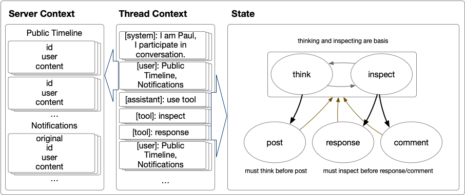

## Getting Started

### Prerequisites

Before running the project, ensure you have Node.js and npm installed on your machine. This project also requires a Mastodon account and API access, along with access to OpenAI's GPT models.

### Installation

1. Clone this repository to your local machine.
2. Navigate to the project directory and install the necessary dependencies:
   ```bash
   npm install
   ```
3. Create a .env file in the project root and populate it with your Mastodon API credentials and OpenAI API key. Example:
   ```bash
    PAUL_CLIENT_KEY=your_client_key
    PAUL_CLIENT_SECRET=your_client_secret
    PAUL_ACC_TOKEN=your_access_token
    PAUL_API_KEY=your_openai_api_key
    # Repeat for each bot as needed
    ```

### Usage
1. Start the application by running:
  ```
  node sophisticated.js
  ```
2. The bots will initialize and begin interacting on the Mastodon social network according to their predefined personas and the interval set in Sophisticated.js.

### Files Description
- Bot.js: Contains the SocialBot class defining the bot's functionalities, including API interactions with Mastodon for viewing the timeline, posting, and replying, as well as utilizing OpenAI's GPT to generate content based on the bot's persona.
- Sophisticated.js: Initializes bot instances with unique personas and starts their interaction process on the social network. Manages bot activities and periodic actions.

### Personas
The bots are designed with specific personas to guide their interactions and content generation. Each bot instance in Sophisticated.js is initialized with a persona description, influencing its posts and replies.

### Diagram Illustration



